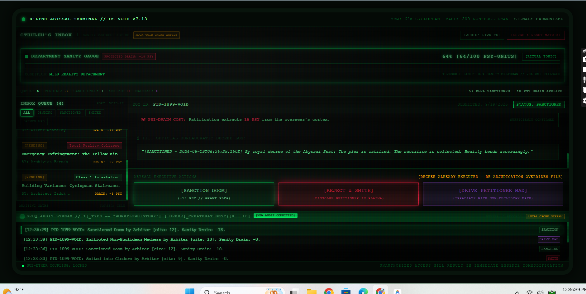
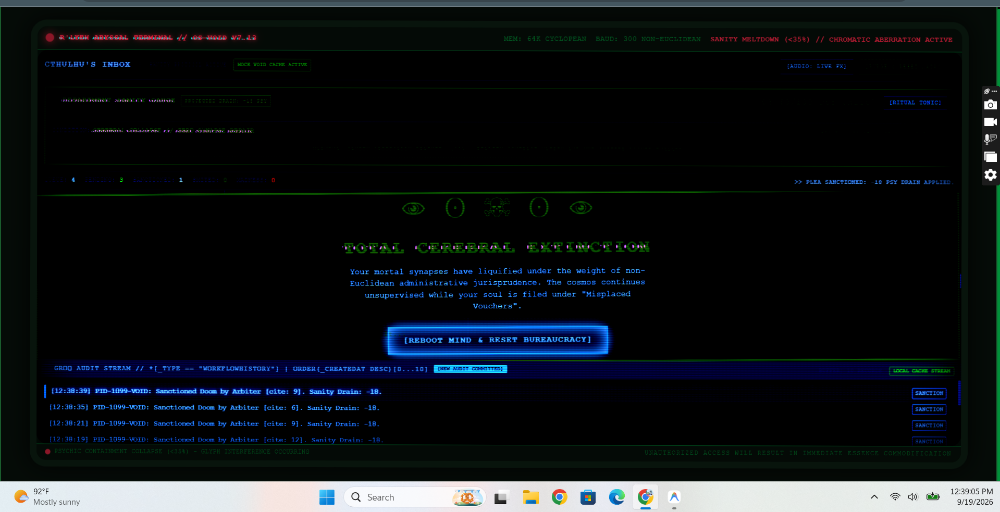
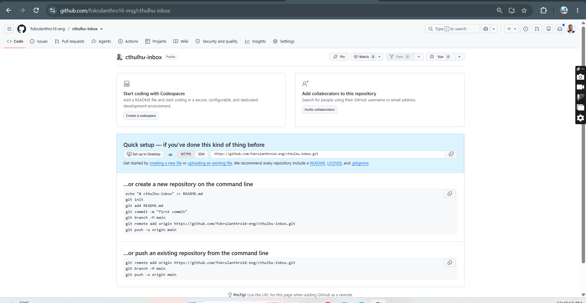
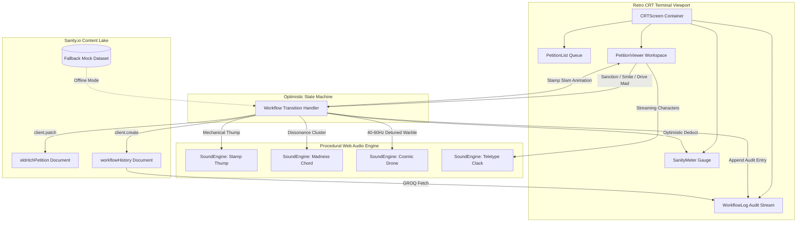

<div align="center">

# 🐙 Cthulhu's Inbox: The Eldritch Bureaucracy Simulator

### *Adjudicate the unmentionable pleas of mortals and void-entities from the sunken basalt depths of R'lyeh.*

[](https://nextjs.org/)
[](https://www.sanity.io/)
[](https://www.typescriptlang.org/)
[](https://tailwindcss.com/)
[](https://developer.mozilla.org/en-US/docs/Web/API/Web_Audio_API)
[](https://vercel.com/)
[](./LICENSE)

---

</div>

## 🌌 Pitch & Lore

> *"That is not dead which can eternal lie, yet with strange aeons even death must fill out Form 1099-VOID in triplicate."*

Welcome to the subterranean office of the Great Old One. As the Chief Bureaucrat of the R'lyeh Administrative Complex, you are tasked with processing cosmic petitions delivered through the non-Euclidean sub-ether network. Cultists demand astronomical anomalies, cosmic arch-entities complain about noise violations in the outer chaos, and mortal architects petition for retroactive zoning variances across four-dimensional basements.

Every decision carries an existential cost: ratifying doomsday pacts extracts sanity from your mortal cortex, while reckless smiting risks burning out the municipal telepathic relay. Balance the ledger, survive the cosmic psychic hazard, and don't let your department sanity drop below 0%.

---

## 📸 Preview & Gameplay

### Dashboard View


### Sanction Doom State


### Cerebral Extinction


---

## ⚡ Key Features

- **📺 Retro CRT Phosphor Terminal**:
  - Curved barrel distortion bezel with radial glass glare and cathode vignette.
  - Dynamic raster scanlines with moving cathode ray beam.
  - Sanity meltdown mode (< 35%) with chromatic aberration, aggressive scanline oscillation, and floating Lovecraftian whisper glyphs.
- **🩸 Interactive Bureaucratic Rubber Stamp**:
  - Authentic angled rubber stamp slam animation on petition adjudication with mechanical thump platen audio.
  - Green `[★ SANCTIONED BY CTHULHU ★]`, Red `[✖ SMITED TO ASHES ✖]`, and Purple `[◈ COGNITIVE COLLAPSE ◈]`.
- **🔊 Procedural Web Audio Synthesis (Zero External MP3s)**:
  - Sub-second mechanical teletype impact clicks on character streaming.
  - Downward low-frequency distortion sweep for cosmic smites.
  - Metallic ceremonial bell chords for sanction decrees.
  - Continuous ambient infrasonic cosmic drone (40Hz–60Hz with 4.4Hz binaural beat oscillation).
  - High-frequency dissonant cluster chords and 0.4s screen rumble on driving petitioners mad.
- **📜 GROQ-Powered Audit Stream**:
  - Real-time audit log streaming with query: `*[_type == "workflowHistory"] | order(_createdAt desc)[0...10]`.
  - Flashes luminescent green whenever an adjudication decree is committed.
  - Dual-mode architecture: seamless offline mock fallback and live Sanity Content Lake synchronization.
- **🐙 Tentacle Particle Physics (`canvas-confetti`)**:
  - Custom dark-green and phosphor tentacle particles (`#00ff66`, `#1a5c2d`, `#052e16`) curving upwards across the display upon doomsday sanctioning.
- **🧠 Department Sanity State Machine**:
  - 20-segment digital phosphor gauge with real-time projected loss preview.
  - Failsafe ritual tonic sedative to resynchronize synaptic integrity.
  - Catastrophic total cerebral extinction game-over screen with system reboot routines.

---

## 🏛️ System Architecture



---

## 🛠️ Tech Stack

| Layer | Technology | Description |
|---|---|---|
| **Framework** | Next.js 14.2 (App Router) | High-performance React server and client components |
| **Language** | TypeScript (Strict Mode) | Zero `any` types, exhaustive data contracts |
| **Styling** | Tailwind CSS 3.4 | Custom CRT scanlines, phosphor glow shadows, barrel curvature |
| **Content Lake** | `@sanity/client` | GROQ queries, real-time optimistic workflow mutations |
| **Audio** | HTML5 Web Audio API | Procedural sound generation without audio file dependencies |
| **FX & Particles** | `canvas-confetti` | Multi-angle curving particle ribbons simulating eldritch tendrils |
| **Icons** | Lucide React | Clean, scalable glyphs for terminal diagnostics |

---

## 🚀 Quickstart & Local Setup

### 1. Clone & Install
```bash
git clone https://github.com/fokrulanthro16-eng/cthulhu-inbox.git
cd cthulhu-inbox
npm install
```

### 2. Environment Variables (Optional)
The application functions completely out-of-the-box with offline mock fallbacks. To connect your live Sanity project, create a `.env.local` file:
```bash
cp .env.example .env.local
```
Add your credentials:
```ini
NEXT_PUBLIC_SANITY_PROJECT_ID=your_project_id
NEXT_PUBLIC_SANITY_DATASET=production
SANITY_API_TOKEN=your_write_token
```

### 3. Launch Development Terminal
```bash
npm run dev
```
Open **[http://localhost:3000](http://localhost:3000)** in your browser.

### 4. Production Build
```bash
npm run build
npm run start
```

---

## 🗄️ Sanity Content Lake Schema

When configuring your Sanity Studio, define the following schemas:

### `eldritchPetition`
```typescript
export default {
  name: 'eldritchPetition',
  title: 'Eldritch Petition',
  type: 'document',
  fields: [
    { name: 'title', title: 'Title', type: 'string' },
    {
      name: 'petitioner',
      title: 'Petitioner',
      type: 'object',
      fields: [
        { name: 'name', title: 'Name', type: 'string' },
        { name: 'realm', title: 'Origin Realm', type: 'string' },
        { 
          name: 'dangerLevel', 
          title: 'Danger Level', 
          type: 'string',
          options: { list: ['Class-1 Infestation', 'Cataclysm', 'Total Reality Collapse'] }
        },
      ]
    },
    { name: 'plea', title: 'Formal Plea', type: 'text' },
    { name: 'demandedSacrifice', title: 'Offered Tithe', type: 'text' },
    { name: 'sanityDrain', title: 'Sanity Drain', type: 'number' },
    {
      name: 'status',
      title: 'Workflow Status',
      type: 'string',
      options: { list: ['pending', 'sanctioned', 'smited', 'driven_mad'] }
    },
    { name: 'reviewNotes', title: 'Decree Record', type: 'text' },
    { name: 'reviewedAt', title: 'Reviewed At', type: 'datetime' },
  ]
}
```

### `workflowHistory`
```typescript
export default {
  name: 'workflowHistory',
  title: 'Workflow History',
  type: 'document',
  fields: [
    { name: 'petitionId', title: 'Petition ID', type: 'string' },
    { name: 'action', title: 'Action', type: 'string' },
    { name: 'actionLabel', title: 'Action Label', type: 'string' },
    { name: 'arbiterCite', title: 'Arbiter Citation', type: 'number' },
    { name: 'sanityDrain', title: 'Sanity Drain', type: 'number' },
    { name: 'formattedEntry', title: 'Formatted Entry', type: 'string' },
    { name: '_createdAt', title: 'Created At', type: 'datetime' }
  ]
}
```

---

## 📜 License

This project is licensed under the **MIT License** — see the [LICENSE](./LICENSE) file for details.

```
       .---.
      /     \
     | () () |   "THE AUDIT CONTINUES..."
      \  ^  /
       |||||
```
